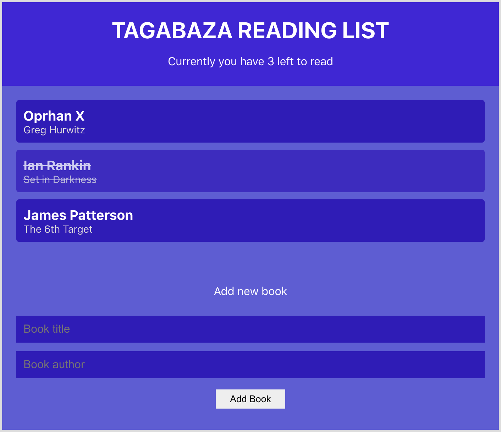

<h1 align="center">
  Reading List Application
</h1>
<p align="center">  
A simple web application built using REACT which holds a users reading list of books. 
</p>
<div>
  
</div>

## My process

### Built with

- Semantic HTML5 markup
- CSS custom properties
- [React](https://reactjs.org/) - JS library
  - Context API
  - Hooks
- Reducers

### What I learned

I can see how much cleaner code is with functional based components as opposed to class based components. Functional components are shorter and simpler which makes them easier to develop and test, especially as there is no dealings with the 'this' keyword which I believe could be confusing in larger projects.

Then the use of Context API and Hooks makes doing away class based components more valid as the sharing and changing of state in a componenet tree is simpler when you don't have to pass down props at every level.

```js
import React, { useContext, useState } from "react";
import { BookContext } from "../contexts/BookContext";

const NewBookForm = () => {
  const { dispatch } = useContext(BookContext);
  const [title, setTitle] = useState("");
  const [author, setAuthor] = useState("");
};
```

Although a Reducer to centralise the methods that change state into a single function was not really needed in a project like this, I can certainly see how beneficial they can be in a larger projects when they allow you to manage all state changes in one place.

```js
export const bookReducer = (state, action) => {
  switch (action.type) {
    case "ADD_BOOK":
      return [
        ...state,
        {
          title: action.book.title,
          author: action.book.author,
          id: uuidv4(),
        },
      ];
    case "REMOVE_BOOK":
      return state.filter((book) => book.id !== action.id);
    default:
      return state;
  }
};
```

```css
.proud-of-this-css {
  color: papayawhip;
}
```

### Continued development

Use this section to outline areas that you want to continue focusing on in future projects. These could be concepts you're still not completely comfortable with or techniques you found useful that you want to refine and perfect.

## Deployment

Deployed with [github pages](https://pages.github.com/).

## Get started

From your command line, first clone this repo:

```bash
# Clone this repository
$ git clone https://github.com/rgneville/cv-app

# Go into the repository
$ cd cv-app

# Remove current origin repository
$ git remote remove origin
```

Then you can install the dependencies using NPM:

Using NPM:

```bash
# Install dependencies
$ npm install

# Start development server
$ npm start
```

You should now have a development server running in your default browser.

This project was bootstrapped with [Create React App](https://github.com/facebook/create-react-app).

## Available Scripts

In the project directory, you can run:

### `npm start`

Runs the app in the development mode.\
Open [http://localhost:3000](http://localhost:3000) to view it in the browser.

The page will reload if you make edits.\
You will also see any lint errors in the console.

### `npm test`

Launches the test runner in the interactive watch mode.\
See the section about [running tests](https://facebook.github.io/create-react-app/docs/running-tests) for more information.

### `npm run build`

Builds the app for production to the `build` folder.\
It correctly bundles React in production mode and optimizes the build for the best performance.

The build is minified and the filenames include the hashes.\
Your app is ready to be deployed!

See the section about [deployment](https://facebook.github.io/create-react-app/docs/deployment) for more information.
