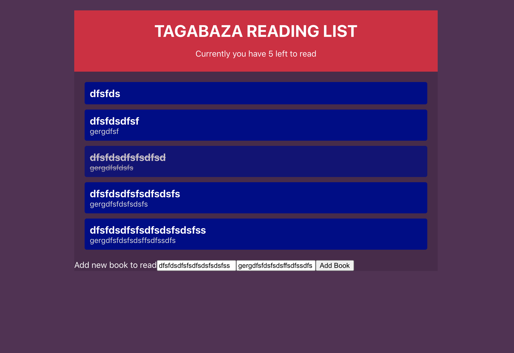

<h1 align="center">
  Reading List Application
</h1>
<p align="center">  
A simple web application built using REACT which holds a users reading list of books. 
</p>
<div>
  
</div>

## My process

### Built with

- Semantic HTML5 markup
- CSS custom properties
- [React](https://reactjs.org/) - JS library
  - Context API
  - Hooks
- Reducers

### What I learned

Can see how much cleaner code is with functional based components, shorter and simpler, easier to develop, maintain and test also less dealings with the "this" confusion from class based components.

Use this section to recap over some of your major learnings while working through this project. Writing these out and providing code samples of areas you want to highlight is a great way to reinforce your own knowledge.

The application features the use of Contexts and Hooks to pass data and manipulate state, in addition to the use of a Reducer to centralise the methods that change state into a single function.

To see how you can add code snippets, see below:

```html
<h1>Some HTML code I'm proud of</h1>
```

```css
.proud-of-this-css {
  color: papayawhip;
}
```

```js
const proudOfThisFunc = () => {
  console.log("🎉");
};
```

### Continued development

Use this section to outline areas that you want to continue focusing on in future projects. These could be concepts you're still not completely comfortable with or techniques you found useful that you want to refine and perfect.

## Deployment

Deployed with [github pages](https://pages.github.com/).

## Get started

From your command line, first clone this repo:

```bash
# Clone this repository
$ git clone https://github.com/rgneville/cv-app

# Go into the repository
$ cd cv-app

# Remove current origin repository
$ git remote remove origin
```

Then you can install the dependencies using NPM:

Using NPM:

```bash
# Install dependencies
$ npm install

# Start development server
$ npm start
```

You should now have a development server running in your default browser.

This project was bootstrapped with [Create React App](https://github.com/facebook/create-react-app).

## Available Scripts

In the project directory, you can run:

### `npm start`

Runs the app in the development mode.\
Open [http://localhost:3000](http://localhost:3000) to view it in the browser.

The page will reload if you make edits.\
You will also see any lint errors in the console.

### `npm test`

Launches the test runner in the interactive watch mode.\
See the section about [running tests](https://facebook.github.io/create-react-app/docs/running-tests) for more information.

### `npm run build`

Builds the app for production to the `build` folder.\
It correctly bundles React in production mode and optimizes the build for the best performance.

The build is minified and the filenames include the hashes.\
Your app is ready to be deployed!

See the section about [deployment](https://facebook.github.io/create-react-app/docs/deployment) for more information.
